# Welcome to MD2PPT

A comprehensive demonstration of Markdown to PowerPoint conversion

- Convert markdown files to professional presentations
- Support for tables, code, diagrams, and more
- Simple CLI: `pptcli md2ppt slides.md output.pptx`

> This is a speaker note! It will appear in the notes section of PowerPoint, not on the slide itself. Use blockquotes for presenter notes.

# Text Formatting

Markdown supports various text styles:

- **Bold text** for emphasis
- *Italic text* for subtle emphasis
- ***Bold and italic*** combined
- `inline code` for technical terms
- Regular text for normal content

## Subheadings Become Bold Bullets

When you use ## or ### headings within a slide, they become bold bullet points. This is useful for organizing content hierarchically.

# Bullet Points & Lists

Different bullet styles all work:

- Dash bullet point
- Another dash point
* Asterisk bullet point
* Another asterisk point
+ Plus bullet point
+ Another plus point

# Data Tables

Tables are automatically styled with headers:

| Feature | Status | Priority |
|---------|--------|----------|
| Tables | Done | High |
| Mermaid | Done | High |
| Code Blocks | Done | Medium |
| Speaker Notes | Done | Medium |
| Images | Placeholder | Low |

# Sales Report Table

| Quarter | Revenue | Growth | Target |
|---------|---------|--------|--------|
| Q1 2024 | $1.2M | +15% | $1.0M |
| Q2 2024 | $1.5M | +25% | $1.3M |
| Q3 2024 | $1.8M | +20% | $1.6M |
| Q4 2024 | $2.1M | +17% | $2.0M |

> Highlight the Q2 growth rate - it was our best quarter!

# Code Examples

Here's a Rust code example:

```rust
fn main() {
    let message = "Hello, PowerPoint!";
    println!("{}", message);
    
    for i in 1..=5 {
        println!("Slide {}", i);
    }
}
```

# Python Code

```python
def create_presentation(title, slides):
    """Create a PowerPoint presentation."""
    pptx = Presentation()
    
    for slide_content in slides:
        slide = pptx.add_slide()
        slide.title = slide_content['title']
        
    return pptx

# Usage
slides = [
    {'title': 'Introduction'},
    {'title': 'Main Content'},
    {'title': 'Conclusion'}
]
create_presentation("Demo", slides)
```

# System Architecture

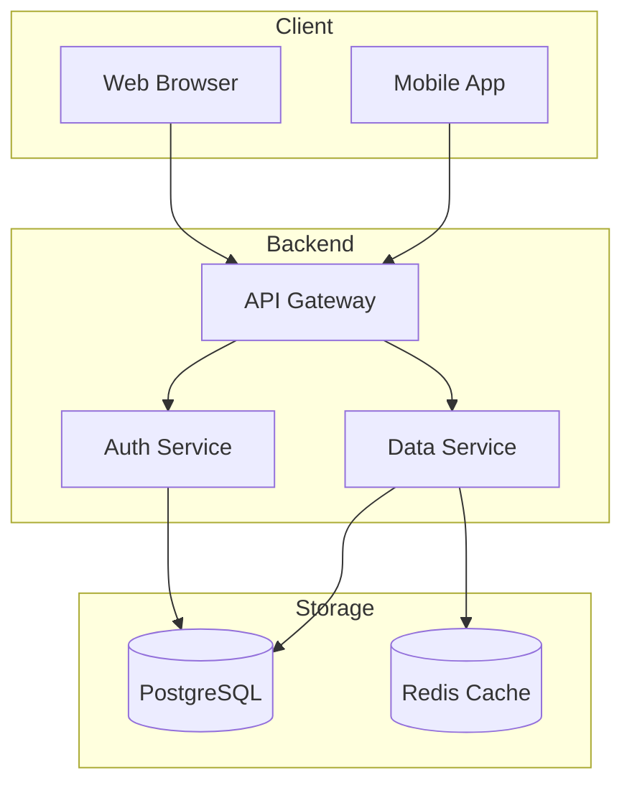

# User Authentication Flow

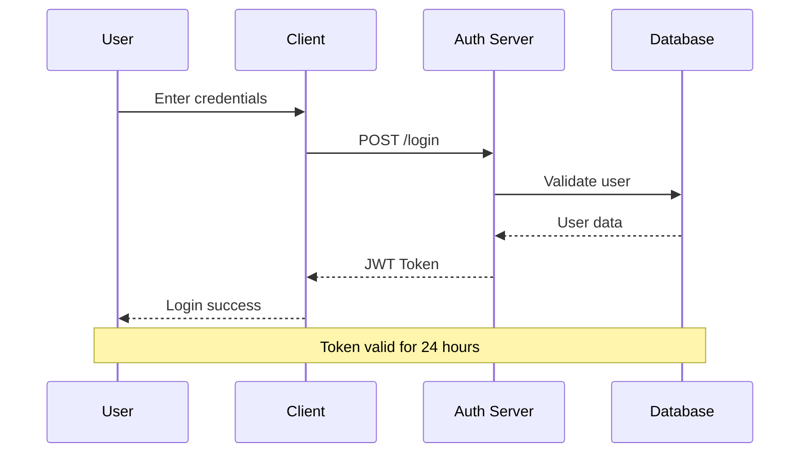

# Project Timeline

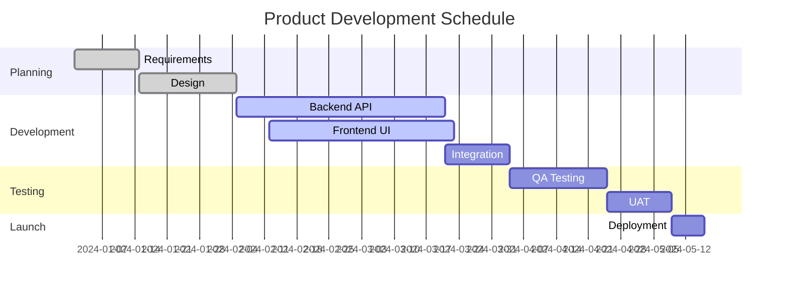

# Data Model

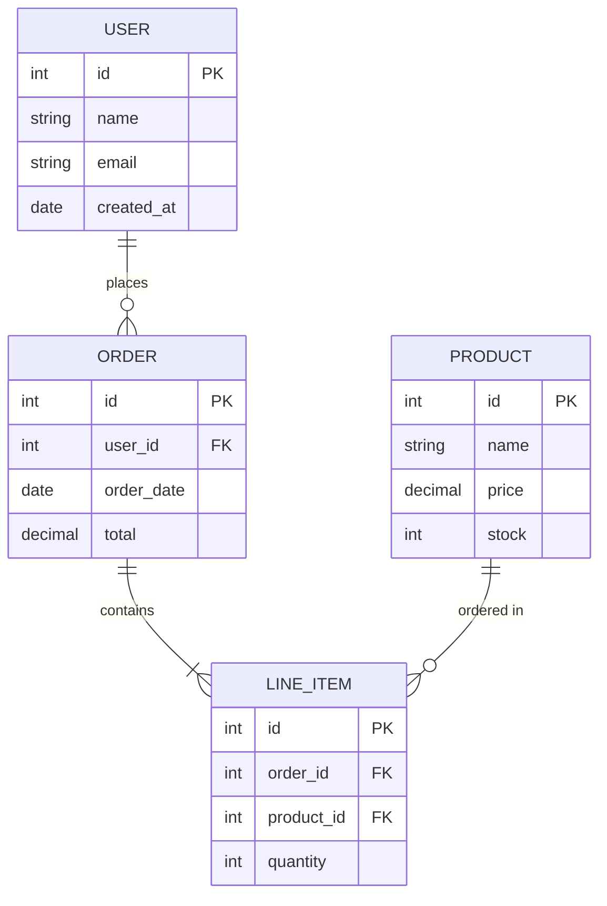

# Application States

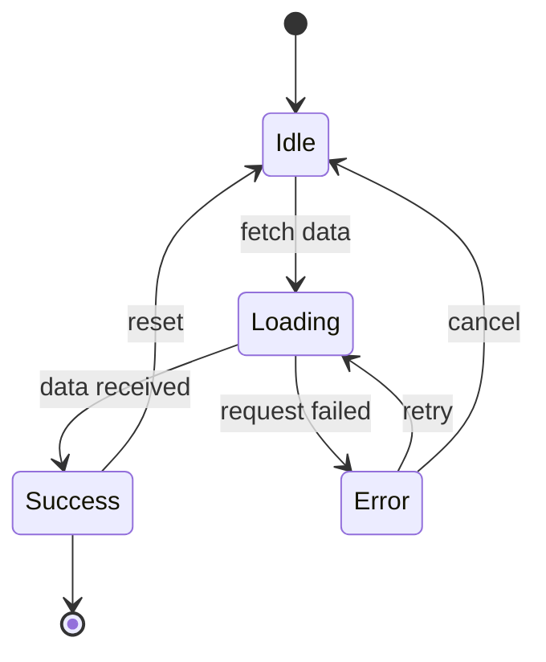

# Class Structure

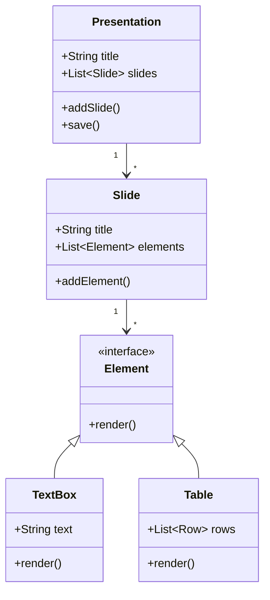

# User Journey

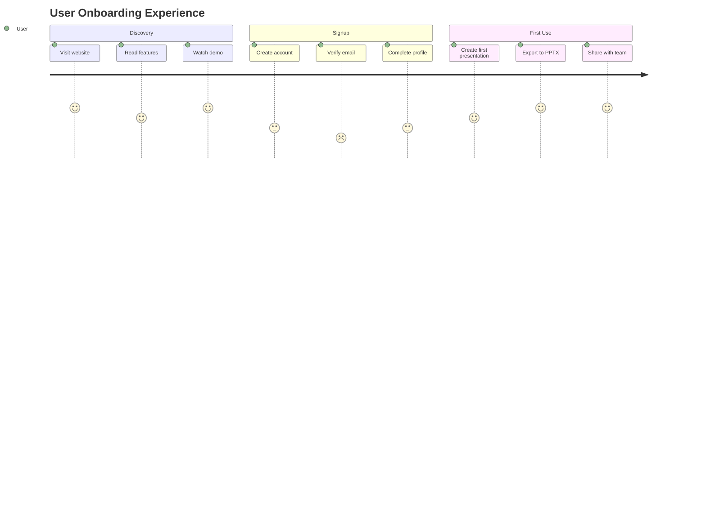

# Market Analysis

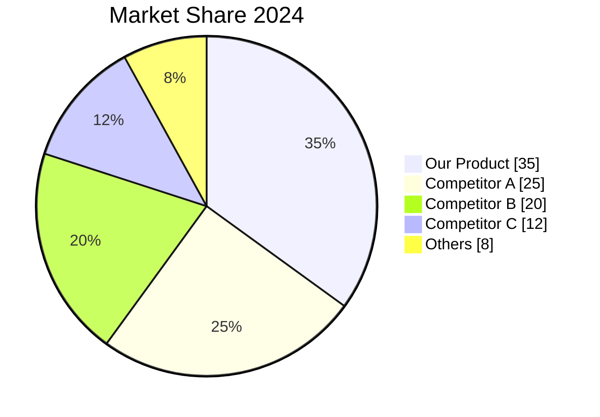

# Feature Priorities

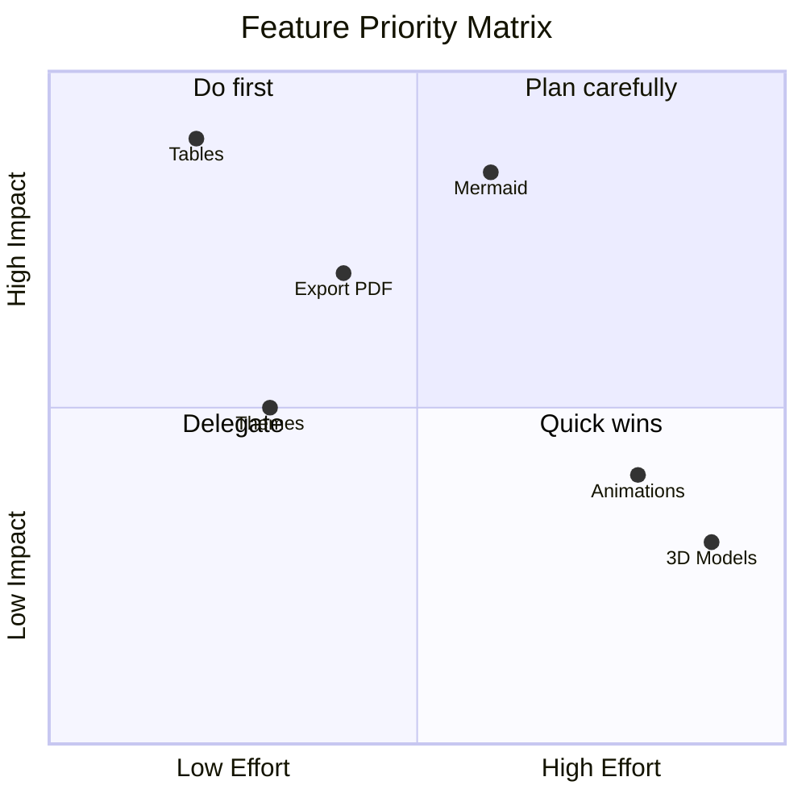

# Development History

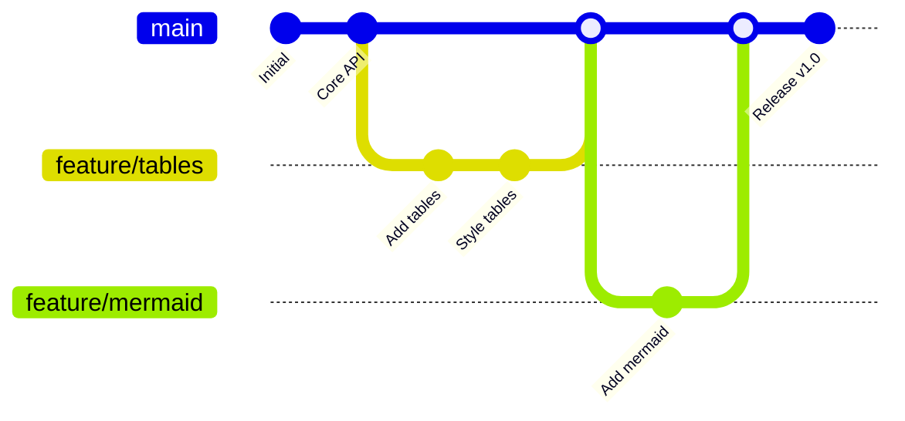

# Project Mindmap

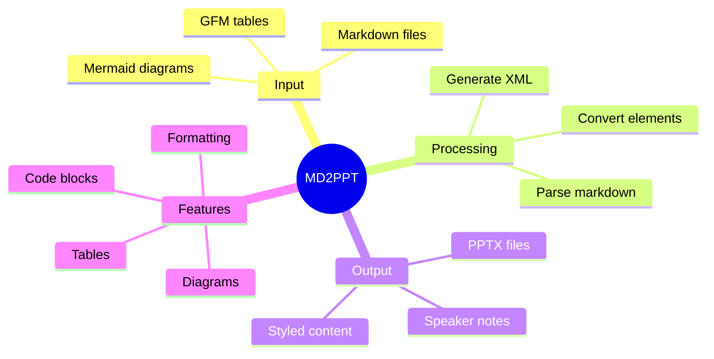

# Project Timeline View

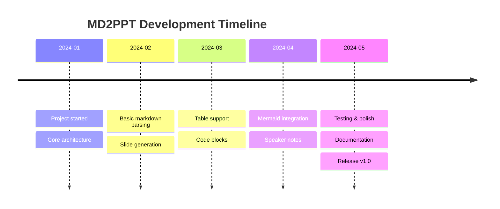

---

# Continuation Slides

When you use `---` (horizontal rule), it creates a continuation slide. This is useful for breaking up long content.

- This slide continues the previous topic
- The title shows "(continued)"
- Great for detailed explanations

# Mixed Content Slide

This slide demonstrates multiple content types:

- First, some bullet points
- With **bold** and *italic* text

| Item | Value |
|------|-------|
| A | 100 |
| B | 200 |

> Remember to explain the table data during the presentation!

# Technical Specifications

| Component | Technology | Version |
|-----------|------------|---------|
| Backend | Rust | 1.75+ |
| CLI | Clap | 4.5 |
| Markdown | pulldown-cmark | 0.10 |
| Archive | zip | 0.6 |
| Testing | insta | 1.34 |

```rust
// Example usage
use ppt_rs::cli::parse_markdown;

let slides = parse_markdown(content)?;
let pptx = create_pptx_with_content("Title", slides)?;
```

# Summary

## What We Covered

- Text formatting (bold, italic, code)
- Bullet points and lists
- Tables with automatic styling
- Code blocks with syntax labels
- 12 types of Mermaid diagrams
- Speaker notes from blockquotes
- Slide breaks with horizontal rules

## Key Benefits

- Simple markdown syntax
- Professional output
- No PowerPoint required
- Version control friendly

> Thank the audience and open for questions!

# Thank You!

Questions?

- GitHub: github.com/yingkitw/ppt-rs
- Documentation: See README.md
- Issues: Report bugs on GitHub

**Try it yourself:**

```bash
pptcli md2ppt presentation.md output.pptx
```
